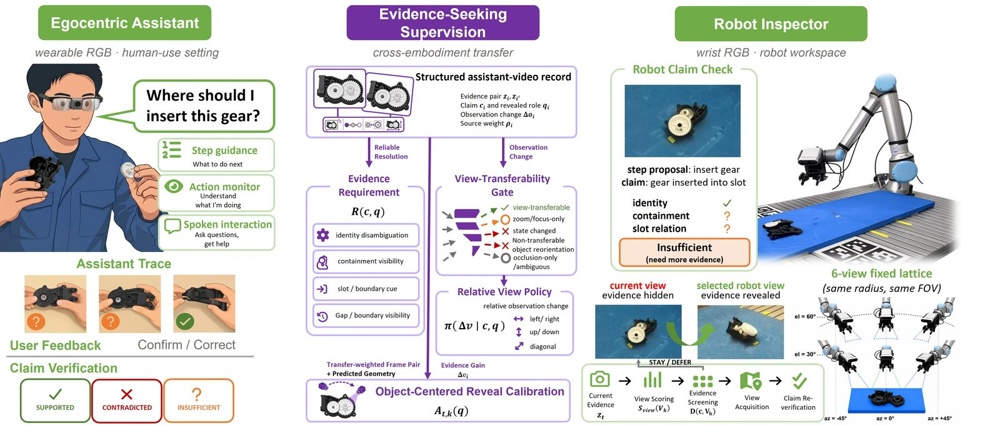
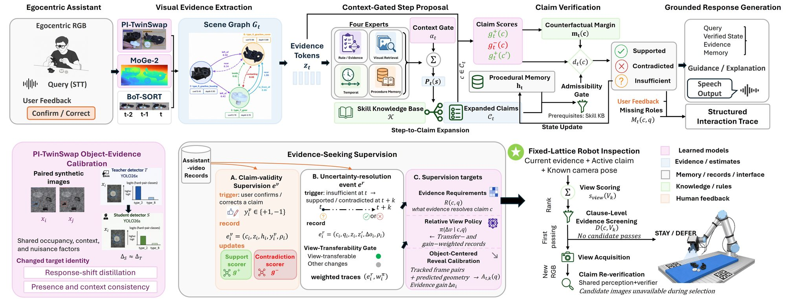

<div align="center">

# INSPECT: Learning Robot View Selection from Assistant Use

[](LICENSE)
[](#installation)
[](#tests)

**Official implementation of *INSPECT: Learning Robot View Selection from Assistant Use*.**



*The evidence that grounds assembly assistance also teaches robots where to inspect.*

</div>

---

INSPECT is an evidence-grounded procedural assistant and active robot
inspection system. It separates step proposal from claim verification,
represents each active claim as `supported`, `contradicted`, or
`insufficient`, and uses ordinary assistant interactions to learn which
evidence a robot camera should reveal next.

The online robot policy receives the current RGB observation, the active claim,
and fixed-lattice geometry. It never observes candidate-view images while
selecting a view.

## System overview

<div align="center">

</div>

The egocentric assistant answers part queries and checks claims against
calibrated visual evidence (top). Resolved claims are organized into
evidence-seeking supervision that separates evidence requirements from
camera-reproducible observation changes (bottom center), and an
object-centered relative view policy selects fixed-lattice robot views with
clause-level evidence screening (bottom right).

## Repository contents

- `assistant/`: grounded single-turn and multi-turn response logic.
- `components/`: detection, geometry, tracking, scene evidence, retrieval,
  temporal fusion, speech, and user-feedback components.
- `inspect_system/`: claim verification, trace export, evidence requirements,
  and fixed-lattice active-view policies.
- `runtime/`: offline-video and live-camera execution.
- `training/`: detector and TwinSwap training utilities.
- `scripts/`: trace mining, model fitting, evaluation, and benchmark entry
  points.
- `tools/`: robot-view annotation tools and the optional Kokoro speech worker.
- `configs/`: portable assistant and robot-policy configurations.
- `tests/`: unit and protocol tests.

Datasets, model checkpoints, generated outputs, API response caches, and paper
artifacts are intentionally not stored in this repository.

## Installation

Python 3.10 or 3.11 is recommended.

```bash
python -m venv .venv
source .venv/bin/activate
python -m pip install --upgrade pip
python -m pip install -r requirements.txt
```

On Windows, activate the environment with
`.venv\Scripts\Activate.ps1`.

Optional capabilities are installed separately:

```bash
python -m pip install -r requirements-assistant.txt
python -m pip install -r requirements-eval.txt
python -m pip install -r requirements-dev.txt
```

MoGe-2, SAM-based segmentation, and hardware-specific PyTorch builds should be
installed from their upstream projects for the target platform. The runtime
degrades explicitly when an optional backend is unavailable.

## Model and data layout

The default configurations use relative paths:

```text
data/
  assistant_videos/
  assistant_qa/
  robot_view_trials/
models/
  detector.pt
  assistant/
  inspection/
  backbones/
outputs/
```

All three directories are ignored by Git. Pass explicit paths on the command
line when using a different layout.

## Run the assistant

Offline video:

```bash
python -m inspect_assist \
  --video data/example.mp4 \
  --yolo-weights models/detector.pt \
  --kb components.json \
  --config configs/assistant_continuous.yaml \
  --device 0
```

Live camera with manual speech input and grounded local-LLM responses:

```bash
python -m inspect_assist \
  --camera 0 \
  --yolo-weights models/detector.pt \
  --kb components.json \
  --config configs/assistant_edge_interactive.yaml \
  --device 0 \
  --interactive \
  --voice-mode manual \
  --eval-realtime
```

Set `INSPECT_QWEN3_MODEL_PATH` in the process environment to select a local
Qwen checkpoint. API credentials are never read from configuration files:
hosted VLM evaluators read `OPENAI_API_KEY` or `GEMINI_API_KEY` from the
process environment. Use an operating-system secret manager or a temporary
shell environment and never commit credentials.

## Build supervision and replay robot inspection

Convert an assistant run into verification-centered artifacts:

```bash
python -m inspect_assist inspect \
  --run-dir outputs/assistant/run_001 \
  --state-specs resources/state_specs.gearbox.json \
  --output-dir outputs/artifacts/run_001
```

Build the assistant-derived evidence requirement profile:

```bash
python -m inspect_assist build-evidence-requirement-profile \
  --event-log outputs/artifacts/run_001/assistant_evidence_events.jsonl \
  --output outputs/models/evidence_requirement_profile.json
```

Replay the fixed-lattice observe-verify-select loop:

```bash
python -m inspect_assist inspect-replay-loop \
  --graph outputs/artifacts/run_001/procedural_evidence_graph.json \
  --robot-observations data/robot_view_trials/robot_observations.jsonl \
  --view-candidates data/robot_view_trials/view_candidates.json \
  --evidence-requirement-profile outputs/models/evidence_requirement_profile.json \
  --view-policy-config configs/robot_view_policy.json \
  --output outputs/robot/decision_loop_replay.json
```

See [docs/REPRODUCTION.md](docs/REPRODUCTION.md) for data contracts and
evaluation entry points.

## Tests

```bash
python -m pytest -q
python scripts/check_release_safety.py --root .
```

Some integration tests require optional models or datasets and skip when those
assets are not available.

## Frozen evaluation artifacts

A few audit and repair scripts replay the frozen paper evaluations. They read
released artifact bundles from `artifacts/` (override with the
`INSPECT_ARTIFACTS_ROOT` environment variable) and raise a `FileNotFoundError`
naming the exact expected file when an input is missing. Scripts that only
need your own data use the `data/`, `models/`, and `outputs/` layout described
above.

## License

The source code is released under the MIT License (see `LICENSE`).
